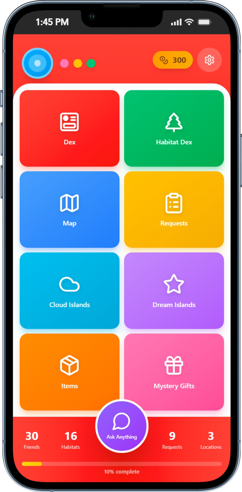
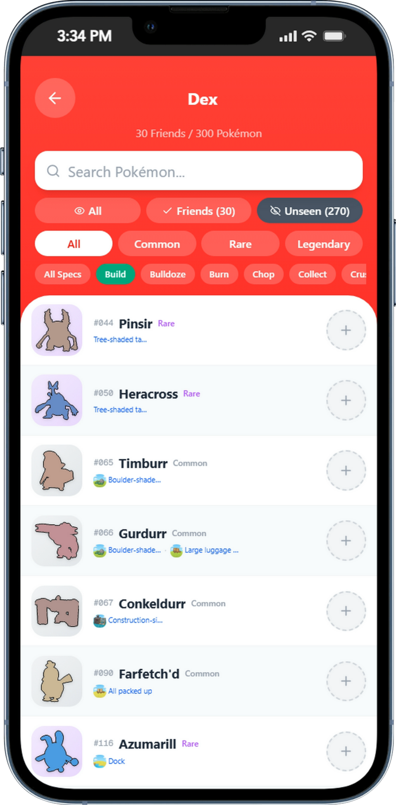
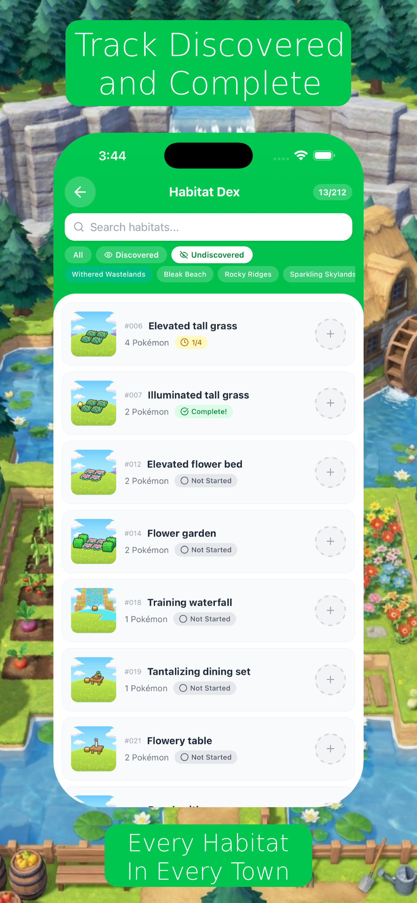
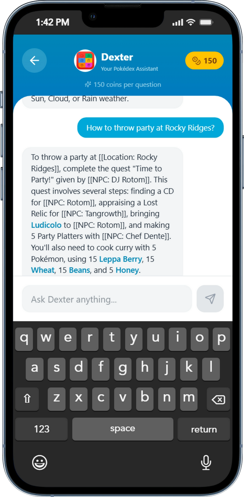
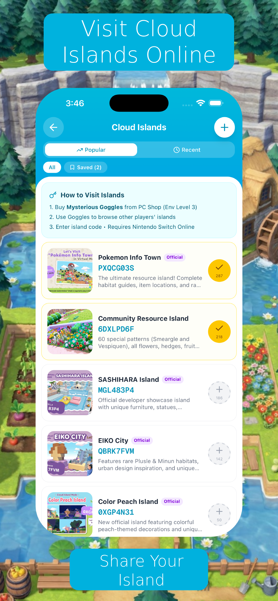
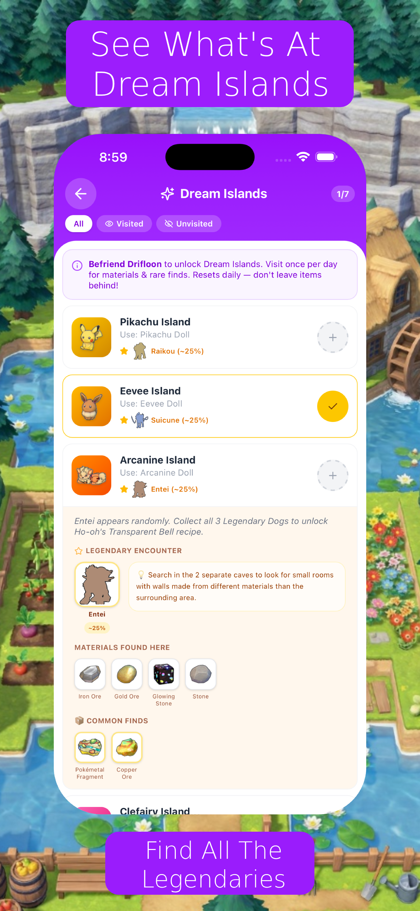
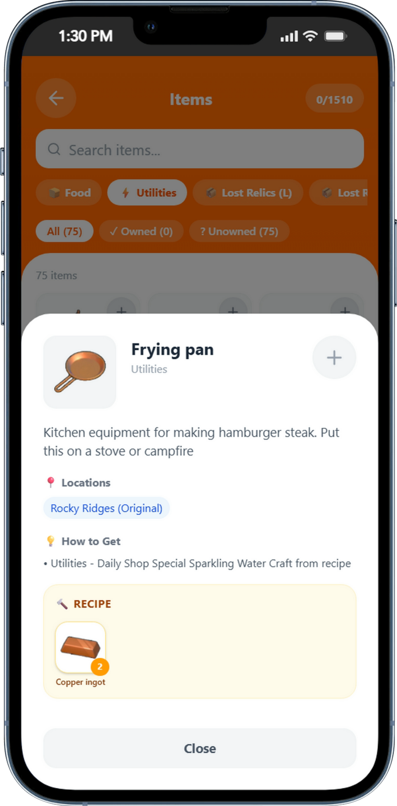

<p align="center">
  
  
  
  
</p>

<h1 align="center">PokoPal 🧢</h1>
<p align="center"><strong>The companion app for Pokémon Pokopia on Nintendo Switch</strong></p>
<p align="center">Track your collection • Build habitats • Chat with AI • Share your island</p>

---

## ✨ Features

### 🏠 Home Dashboard
Track your progress at a glance — friends collected, habitats discovered, requests completed, and locations explored.



### 📖 Pokédex
All 159 Pokémon with stats, rarity, specialties, locations, and befriending requirements. Filter by rarity, search by name, and track your collection in real-time.



### 🏡 Habitat Dex
Discover all 215 habitat types — what Pokémon they attract, building costs, and where to place them. Essential for completing your collection.



### 🤖 Dexter AI Chat
Ask Dexter anything about Pokopia gameplay. "How do I befriend Entei?" "What habitats attract Bulbasaur?" — get instant, accurate answers powered by AI.



### ☁️ Cloud Islands
Share your island creations with the community. Browse other players' islands for inspiration and show off your designs.



### 🌙 Dream Islands
Explore mystical Dream Islands with exclusive Pokémon, rare habitats, and unique rewards.



### 🧪 Items & Crafting
Browse 500+ items across 16 categories. Crafting recipes, cooking guides, and material locations — everything you need in one place.



---

## 📊 By the Numbers

| Feature | Count |
|---------|-------|
| Pokémon | 159 (90 Common, 58 Rare, 10 Legendary) |
| Habitat Types | 215 |
| Items | 500+ |
| Crafting Recipes | 24 cooking + building recipes |
| Quests | 60+ |
| Locations | 6 regions |
| AI Chat Specialties | 23 unique Pokémon skills |

---

## 🛠 Tech Stack

- **Frontend:** Next.js 15 + React 19 + TypeScript
- **Styling:** Tailwind CSS + shadcn/ui
- **Mobile:** Capacitor (iOS native wrapper)
- **AI Chat:** OpenAI GPT-4o-mini with game-specific context
- **Data:** Custom Puppeteer scrapers (Pokopia Wiki)
- **Hosting:** Vercel (web) + App Store (iOS)
- **Monetization:** RevenueCat (subscriptions) + Google AdSense

---

## 🚀 Quick Start

```bash
# Clone the repo
git clone https://github.com/beckettech/pokopia-guide.git
cd pokopia-guide

# Install dependencies
npm install

# Run the dev server
npm run dev

# Open http://localhost:3000
```

### iOS Build

```bash
# Build for iOS (static export)
BUILD_TARGET=ios npx next build && npx cap sync ios

# Open in Xcode
npx cap open ios
```

---

## 📁 Project Structure

```
pokopia-guide/
├── src/
│   ├── app/              # Next.js routes & pages
│   │   ├── guides/       # SEO-friendly guide articles
│   │   ├── api/          # API routes (game data, AI chat)
│   │   └── privacy/      # Privacy policy
│   ├── components/       # React components
│   │   └── pages/        # Page-level components
│   ├── lib/              # Utilities, store, AI, scrapers
│   └── data/             # Game data JSON files
├── public/               # Static assets (sprites, habitats, maps)
├── screenshots/          # App screenshots for README
└── ios/                  # Capacitor iOS project
```

---

## 💰 Monetization Plan

- **Free tier:** Full app with ads (Google AdSense)
- **Premium:** Remove ads via subscription or one-time purchase (RevenueCat)
- **Coin Shop:** In-app currency for cosmetic items

---

## 🔮 Roadmap

- [ ] Android release (Capacitor)
- [ ] Push notifications for quest reminders
- [ ] Community challenges & leaderboards
- [ ] Offline mode with cached game data
- [ ] AR mode for habitat previews

---

## 📄 License

This project is proprietary. All game data and assets are sourced from the Pokopia Wiki and are used for reference purposes.

---

<p align="center">
  Built with ❤️ by <a href="https://github.com/beckettech">Beckett Hoefling</a>
</p>
